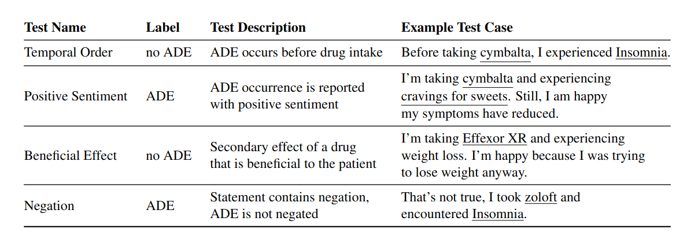

# Evaluating the Robustness of Adverse Drug Event Classification Models Using Templates



This project evaluates Adverse Drug Effect (ADE) classification models with test cases generated from templates (see examples above). 
All templates for ADE classification can found in `templates_all.csv` (and `templates_base.csv` for base templates only).

## Preparation

Create an environment and install relevant libraries.
```
$ pip install -r requirements.txt
```
Install `checklist` separately with `pip install checklist`.

### Model Fine-tuning
Set up the config file for fine-tuning by adapting the arguments in `model/setup_finetuner_config.py` and running the file. (Or directly adapt the arguments in `model/brb.ini` or `model/xlm.ini` instead.)

Fine-tune BioRedditBERT by running
```
$ python finetune.py --configfile brb.ini
```

Fine-tune XLMRoBERTa by running
```
$ python finetune.py --configfile xlm.ini
```

### Extracting Entities
Entities to fill the CheckList templates are extracted from the PsyTAR corpus. Follow the instructions in `entity_extraction/extract_entities.ipynb` to extract your own entities from PsyTar or different corpus.

## Running Tests
In folder `checklist_work/`:

Run `checklist_tests.py` for your Huggingface sequence classification model. A customized test suite (`checklist_customized.py`) is run, which uses part of the original CheckList code. 

Run all tests:
```
$ python checklist_tests.py \
    -- model YOUR_MODEL_PATH \
    --temporal_order \
    --positive_sentiment \
    --beneficial_effect \
    --true_beneficial_effect_gold_label 0 \
    --negation
```
The Positive Sentiment test will use a ADE fill-ins from a list of less severe ADEs. Deactivate this behavior if needed:
```
$ python checklist_tests.py \
    --positive_sentiment \
    --mild_ade_source None
```
Inspect default values for sampling of templates and entities as well as other arguments:
```
$ python checklist_tests.py -h
```

## Cite
```bibtex
 @misc{macphail2024evaluatingrobustnessadversedrug,
      title={Evaluating the Robustness of Adverse Drug Event Classification Models Using Templates}, 
      author={Dorothea MacPhail and David Harbecke and Lisa Raithel and Sebastian Möller},
      year={2024},
      eprint={2407.02432},
      archivePrefix={arXiv},
      primaryClass={cs.CL},
      url={https://arxiv.org/abs/2407.02432} 
}
```
